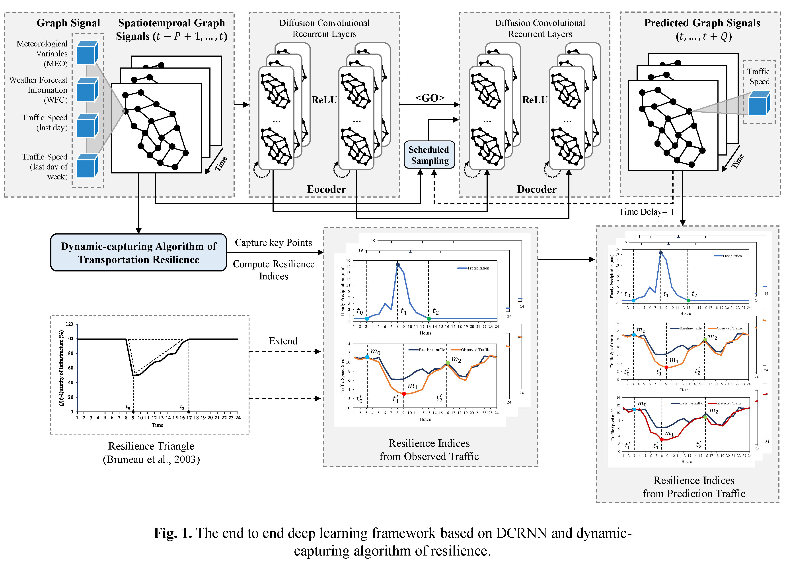

# Evaluation and prediction of transportation resilience under extreme weather events: A diffusion graph convolutional approach

 

In this study, a novel end to end deep learning framework is proposed to estimate and predict the spatiotemporal patterns of transportation resilience under extreme weather events. The framework is based on the Diffusion Graph Convolutional Recurrent Neural Network (DCRNN) and the dynamic-capturing algorithm of resilience. The model can fully extract and adaptively learn the spatiotemporal features of urban transportation network, with integrating temporal and topological-spatial modeling. The on-demand ride services data provided by DiDi Chuxing and auxiliary grid meteorological data are employed to estimate the characteristics of real-world transportation resilience and validate the spatiotemporal predictions of resilience. 

This research was conducted based on the results of Hongwei Wang (the first author) ’s research intern in DiDi Chuxing. The traffic data of the research were extracted from the commercial cloud database of DiDi, and were temporarily classified due to the DiDi’s concerns about privacy and information security. We have already made efforts to publish part of the data, but the application was still in progress. Alternatively, researchers can apply for a full traffic dataset from GAIA Open Dataset Initiative of DiDi, which is an open dataset project to provide academic community with real-life application use cases, anonymized data, and computing resources. More details of GAIA Open Dataset Initiative are available in
```bash
https://outreach.didichuxing.com/research/opendata/en/
```
The codes of this research also partly belong to DiDi, but we could publish part of them after several rounds of talks with DiDi. We can open the codes of data collection and preprocessing, and the revised codes of DCRNN according to our research. The detailed pseudo-codes have already been provided in the paper. 

### Requirements
- scipy>=0.19.0
- numpy>=1.12.1
- pandas>=0.19.2
- pyaml
- statsmodels
- tensorflow>=1.3.0
- ncl
- netcdf4
- wrf-python

The specific process of data-preparation, data-preprocessing and model-building are carefully descripted as following steps:

## 1. Data preparation
The data this research utilized can be divided into two parts: traffic speed data and meteorological data. 


## 1.1 Traffic speed data.
Researchers can apply a full dataset by themselves from GAIA Open Dataset Initiative of DiDi, which is available in `https://outreach.didichuxing.com/research/opendata/en/` The format of traffic data is:

| road_id | longitude | latitude | time | distance | road_speed |
|:---:|:---------:|:---------:|:---------------------:|:-----:|------:|
| 0A  | 114.10515	| 22.57997	| 2017-04-07 00:00:00		| 597.0	| 14.504627 | 
| 0A  | 114.10515	| 22.57997	| 2017-04-07 01:00:00		| 597.0	| 13.641906 | 
| 0A  | 114.10515	| 22.57997	| 2017-04-07 02:00:00		| 597.0	| 15.289080 | 
| 0A  | 114.10515	| 22.57997	| 2017-04-07 03:00:00		| 597.0	| 13.940859 | 
| 0A	| 114.10515	| 22.57997	| 2017-04-07 04:00:00		| 597.0	| 15.947758 | 
| 0A	| 114.10515	| 22.57997	| 2017-04-07 05:00:00		| 597.0	| 14.272239 | 
| 0A	| 114.10515	| 22.57997	| 2017-04-07 06:00:00		| 597.0	| 11.553982 | 
| 0A	| 114.10515	| 22.57997	| 2017-04-07 07:00:00		| 597.0	| 11.226242 | 
| 0A	| 114.10515	| 22.57997	| 2017-04-07 08:00:00		| 597.0	| 11.967376 | 
|...  |    ...    |    ...    |    ...                |  ...  |    ...    |


### 1.2 meteorological data
Generally, hourly averaged meteorological data are accessed from the National Center for Atmospheric Research (NCAR), and then processed with the Weather Research and Forecasting (WRF) model to produce grid meteorological and weather forecast data. One of advantages of employing grid meteorological data is that we can have specific meteorological features in each grid (like a grid spacing of 5 km, e.g. 20 * 40 in shenzhen, totally 800 grids). However, if we only use the monitoring station data, at most time we could just konw the general meteorological status because of the sparse distribution of urban meteorological monitoring stations (like 5-10 stations in a city).

The meteorological data we used is avaliable at [Baidu Netdisk](https://pan.baidu.com/s/1v7FTyb2VpLghoFg86V4E5w). A sample of raw meteorological data is also avaliable here.

If you would like to conduct resilience research in other cities, you can access and generate the WRF meteorological data by yourselves. Here are the steps for production of meteorological data.

General introduction of WRF model is avaiable at 
```bash
https://www.mmm.ucar.edu/weather-research-and-forecasting-model
```
The handbook of WRF is here [WRF\WRFUsersGuide.pdf](https://github.com/Charles117/resilience_shenzhen/tree/master/WRF/WRFUsersGuide.pdf)

*** Requirements: a linux system (like Ubuntu 16.04),and basic knowlogde of linux, command of shell and fortran

### 1.2.1. Install WRF
Detailed steps can be checked here: 
```bash
http://www2.mmm.ucar.edu/wrf/OnLineTutorial/compilation_tutorial.php
```
See steps: 1. System Environment Tests; 2. Building Libraries; 3. Library Compatibility Tests; 4. Building WRF; 5. Building WPS.


### 1.2.2. Download original data from NCAR

### (1) Static Geography Data: geodata 3.9
The data is avaiable at 
```bash
http://www2.mmm.ucar.edu/wrf/users/download/get_sources_wps_geog_V3.html
```
Download Complete Dataset + Download New Static Data Released With v3.9 from
```bash
http://www2.mmm.ucar.edu/wrf/src/wps_files/geog_complete.tar.gz
http://www2.mmm.ucar.edu/wrf/src/wps_files/geog_new3.9.tar.bz2
```

### (2) Real-time Data: ds083 data
You need to first register a account in 
```bash
https://rda.ucar.edu
```
Then download .grib2 data from 
```bash
https://rda.ucar.edu/datasets/ds083.2/
```
e.g.:  
2018 data: 
```bash
https://rda.ucar.edu/datasets/ds083.2/index.html#sfol-wl-/data/ds083.2?g=22018
```
2019 data: 
```bash
https://rda.ucar.edu/datasets/ds083.2/index.html#sfol-wl-/data/ds083.2?g=22019
```
Note: DO NOT DOWNLOAD grib2.nc FORMAT DATA.

### (3) Apply Static Geography Data and Real-time Data
See steps of 6. Static Geography Dat; 7. Real-time Data in the compilation tutorial `http://www2.mmm.ucar.edu/wrf/OnLineTutorial/compilation_tutorial.php` to know how to use the data.

### 1.2.3. Run WPS and WRF
Details steps can be checked in 8. Running WPS and 9. Running WRF in the above compilation_tutorial.
The two config files containing specific parameters to generate meteorological data in Shenzhen is listed in the WRF documents in [WRF\namelist_shenzhen.input](https://github.com/Charles117/resilience_shenzhen/tree/master/WRF/namelist_shenzhen.input) and [WRF\namelist_shenzhen.wps](https://github.com/Charles117/resilience_shenzhen/tree/master/WRF/namelist_shenzhen.wps)

### 1.2.4. Install NCL
The NCAR Command Language (NCL), a product of the Computational & Information Systems Laboratory at the National Center for Atmospheric Research (NCAR) and sponsored by the National Science Foundation, is a free interpreted language designed specifically for scientific data processing and visualization.
Details about NCL can be checked here: 
```bash
https://www.ncl.ucar.edu/overview.shtml
```

If you would like to process the WRF data, NCL is necessary. Here, we recommend the method Installing NCL with "conda".
From a UNIX terminal window in sh/bash mode, type:
```bash
conda create -n ncl_stable -c conda-forge ncl
source activate ncl_stable
```
You will need to run the `source activate ncl_stable` command every time you log out and log back in.

More details of NCL in python is avaiable in 
```bash
https://www.ncl.ucar.edu/Download/conda.shtml
```

### 1.2.5. Install wrf-python.
wrf-python is a basic module to support researchers to process WRF data in python.
To create a conda environment and install the desired packages, type the following in a UNIX terminal window:
```bash
conda create -n wrf_tutorial -c ncar -c khallock -c bladwig pynio basemap jupyter pyngl wrf-python xarray
conda install netcdf4
```
More details of wrf-python is avaiable in `http://www.ncl.ucar.edu/Training/Tutorials/WRF_Users_Workshop/python.shtml`

## 2. Data-preprecessing

There are several steps for data preprocessing:  

(1) aggregate all the traffic speed and meteorological readings into 1-hour time intervals and fill missing data with interpolation;

(2) find closest meteorological grid for each traffic sensor, then assign meteorological information to this traffic sensor according to the geo-coordinate; 

(3) form the data to the shape (samples, time steps, sensors, input features) for X and the shape (samples, time steps, sensors, output features) for X_s. In this experiment, the shapes of X and X_s respectively are (642, 24, 1378, 14) and (642, 24, 1378, 1) for 24-hour prediction issues. Note that the number difference (7 days) of samples, compared with the total 649 days in dataset, is caused by building the feature of speed in last day of week; 

(4) normalize dataset by Z-Score method;  

(5) 70% of the data are used for training, 20% are used for testing, and the rest 10% for validation.  

### 2.1 Extract meteorological data from WRF-generated data.
We extact meteorological data from wrfout data, like `wrfout_d01_2018-01-01_00:00:00`.
Codes can be checked here: [data_preprocessing/wrf_extraction_shenzhen.py](https://github.com/Charles117/resilience_shenzhen/tree/master/data_preprocessing/wrf_extraction_shenzhen.py)

### 2.2 Build the model input 
We merge traffic data and meteorological data, then form them together for building a model input for DCRNN.
Codes can be checked here: 
[data_preprocessing/merge_data_and_build_input.py](https://github.com/Charles117/resilience_shenzhen/tree/master/data_preprocessing/merge_data_and_build_input.py)


### 2.3 Graph Construction
 As the currently implementation is based on Shenzhen network distances between sensors. However, we could not publish the specific locations of sensors right now, due to the concenrn of information security in DiDi Smart Transportation. You can apply the traffic data from GAIA Open Dataset first, and then build the graph by yourself.
 ```bash
python -m scripts.gen_adj_mx  --sensor_ids_filename=data/sensor_graph/graph_sensor_ids.txt --normalized_k=0.1\
    --output_pkl_filename=data/sensor_graph/adj_mx.pkl
```
More details can be checked in the github of original DCRNN authors: `https://github.com/liyaguang/DCRNN`.


## 2. Model Training
In the github of original DCRNN `https://github.com/liyaguang/DCRNN`, the authors claimed that the model could "maps P-dimensional features to Q-dimensional outputs". However, there were still some bugs when we really applied a P-to-Q dimension modelling. Thus, we checked tha codes and fixed these bugs in the revised codes. There are several things needed to be paid attention before you employ DCRNN in your research.

1. Data preprocessing. When you apply a P-to-Q dimension modelling, you cannot just set the output dimension as Q, there would be errors reported. You need to keep the dimension of input and output equal, with padding some zeros dimensions into output. For example, if input dim is 10 and output dim is 1, and you need to pad 9 zero-dims into output. In [data_preprocessing/merge_data_and_build_input.py](https://github.com/Charles117/resilience_shenzhen/tree/master/data_preprocessing/merge_data_and_build_input.py), we already have done this operations, you can feel free to use the codes directly.

2. Loss functions. The loss function cannot be directly changed in [dcrnn_sz.yaml](https://github.com/Charles117/resilience_shenzhen/tree/master/dcrnn_sz.yaml). You need to change the codes in [dcrnn_supervisor.py](https://github.com/Charles117/resilience_shenzhen/tree/master/dcrnn_supervisor.py), `Line 79, 233-234, 285-294` to other loss functions. Remember, import the metrics first, like `from lib.metrics import masked_mae_loss, masked_rmse_loss, masked_mse_loss`

3. Hyper-parameters. The major hyper-meter of DCRNN are iffusion stes, nodes and layers, which can be tuned in [dcrnn_sz.yaml](https://github.com/Charles117/resilience_shenzhen/tree/master/dcrnn_sz.yaml). The name of the file of a well-trained model means `diffusion_step-timestep-nodes(layers)-learning_rate-batchsize`, e.g. dcrnn_DR_1_h_24_256-256_lr_0.01_bs_4. 

The model train process can be started with (runging in linux backend):
```bash
nohup python -u dcrnn_train_sz.py --config_filename=dcrnn_sz.yaml > dcrnn_train_sz.out 2>&1 &
```
Each epoch takes about 100s-400s on a single RTX Titan, depending on the computation complexity. [dcrnn_sz.yaml](https://github.com/Charles117/resilience_shenzhen/tree/master/dcrnn_sz.yaml) is the config file of the model training. 

## 2. Model Prediction
The model inference process can be started with (runging in linux backend):
```bash
nohup python -u run_inference_sz.py --config_filename=config_inference_sz.yaml  --output_filename=data/dcrnn_predictions_sz.npz > run_demo_sz_ts12.out 2>&1 & 
```
Note, [config_inference_sz.yaml](https://github.com/Charles117/resilience_shenzhen/tree/master/config_inference_sz.yaml) is the config file of the model inference.  

## Acknowledgements

We thank Li et al. to publish their codes of original DCRNN to facilitate this research field, which are cited from:

```
https://github.com/liyaguang/DCRNN

@inproceedings{li2018dcrnn_traffic,
  title={Diffusion Convolutional Recurrent Neural Network: Data-Driven Traffic Forecasting},
  author={Li, Yaguang and Yu, Rose and Shahabi, Cyrus and Liu, Yan},
  booktitle={International Conference on Learning Representations (ICLR '18)},
  year={2018}
}
```
